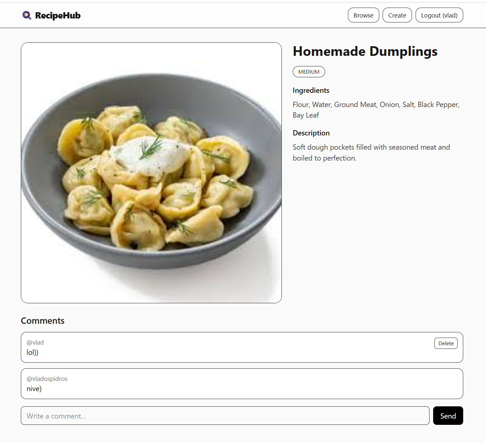
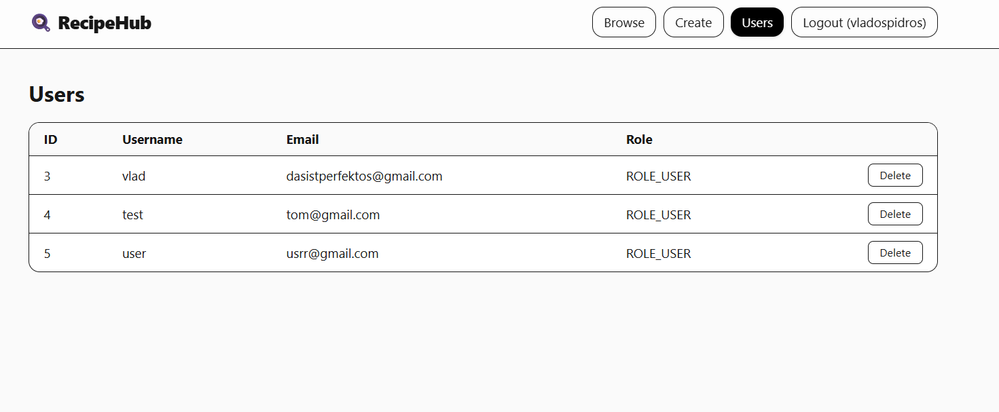
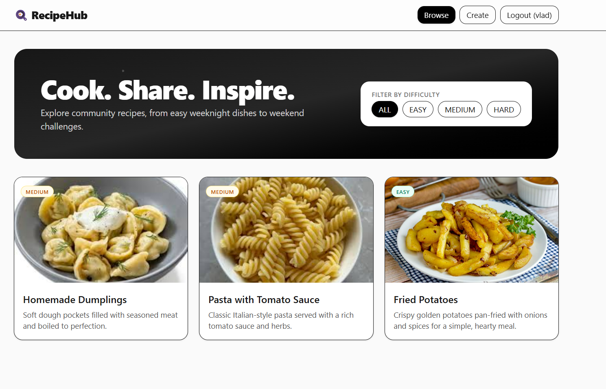

# 🍳 RecipeHub — Full Stack Recipe Sharing Platform

## Screenshots

### Recipe with Comments

### Admin Users

### Main Page

---

## 📖 Project Overview
RecipeHub is a **full stack recipe sharing application** built with a strong backend in **Java Spring Boot** and a modern frontend using **React + Tailwind CSS**.  
It allows users to **register, log in, create recipes with images**, browse and filter recipes by difficulty, and comment on recipes.  
Administrators have access to a dedicated panel to manage users.

This project demonstrates both **backend engineering skills** (security, REST API design, AWS S3 integration, validation) and **frontend development** (responsive UI, routing, form handling, toasts).

---

## 🛠 Backend (Java + Spring Boot)

- **Spring Boot 3**, **Spring Security (JWT)**, **JPA/Hibernate**, **MySQL**
- Authentication & Authorization with roles: `ROLE_USER` and `ROLE_ADMIN`
- **REST API** with CRUD for recipes and comments
- **Image upload to AWS S3**
- Backend validation with meaningful error responses
- Role-based access control for admin features
- CORS configured for frontend integration

**Main Endpoints:**
- Auth: `POST /api/public/auth/signup`, `POST /api/public/auth/signin`
- Recipes: create, read, update, delete, filter by difficulty
- Comments: per recipe, with delete permissions for authors/admins
- Admin: list and delete users (`ROLE_ADMIN` only)

---

## 🎨 Frontend (React + Tailwind CSS)

- Built with **Vite** for fast development
- **React Router** for navigation
- **Axios** for API communication
- **React Hook Form** for form validation
- **react-hot-toast** for success/error notifications
- Recipe list with difficulty filter
- Detailed recipe page with comments
- Admin panel for user management
- Fully responsive and modern UI design

---